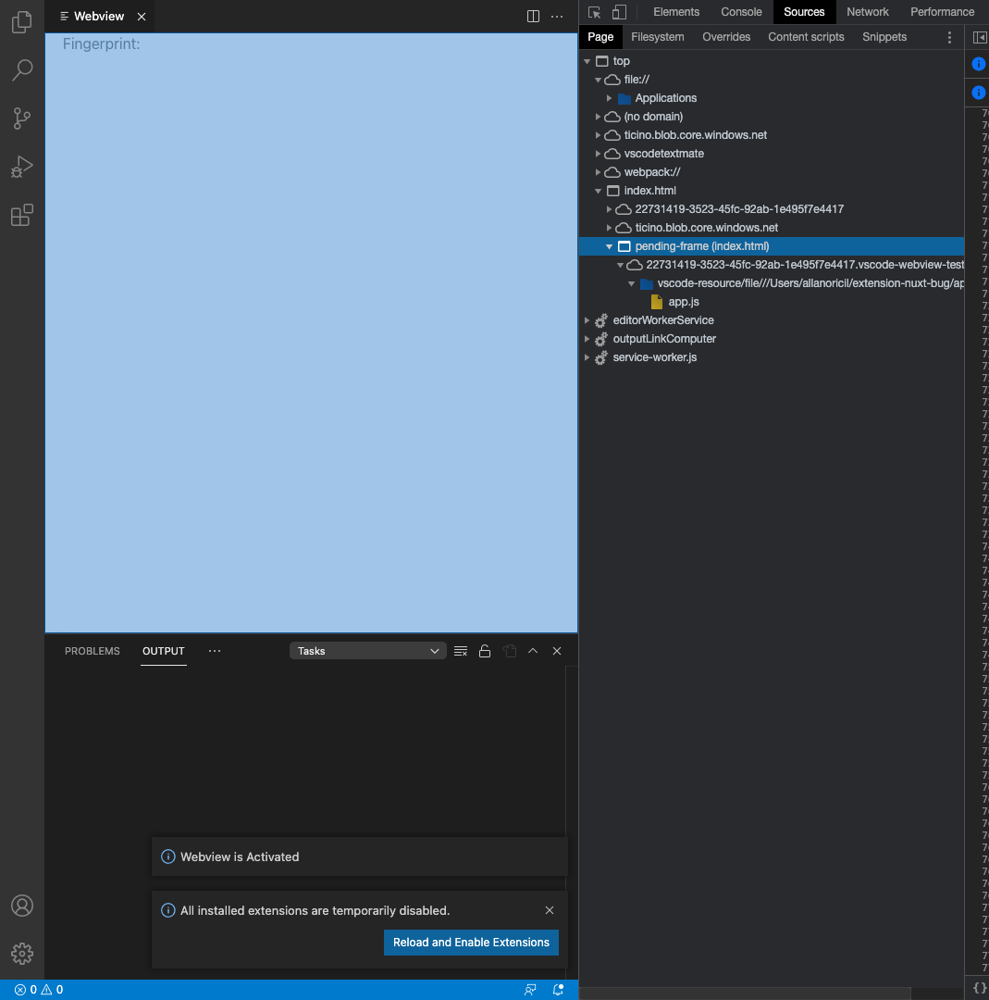
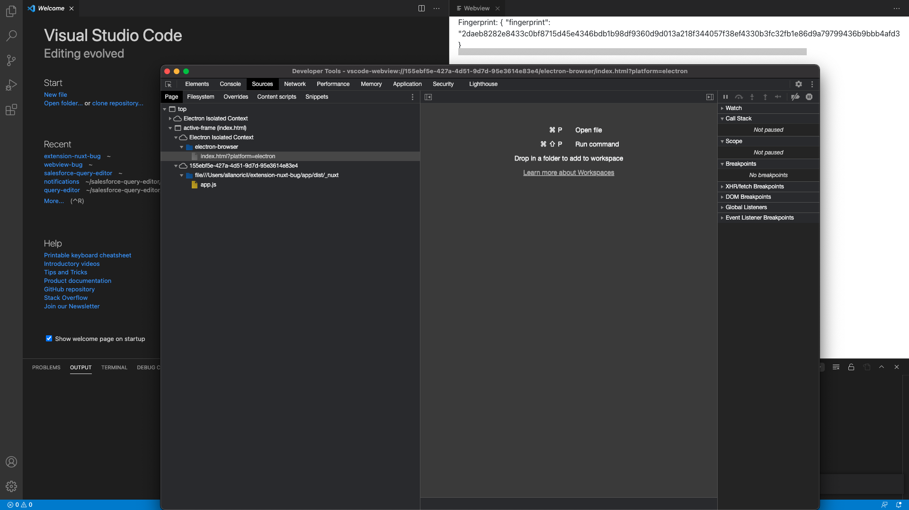

# Steps

1 - on the root of the project, run `yarn install` and `yarn dev` to build the extension with source maps

2 - on the app dir, run `yarn install`, `yarn build:vscode` followed by `yarn generate:vscode` to build the app.js, which is the only script that is added to the html.

3 - then go to `Debug on VS Code` and click on the play button

4 - open the webview with `TEST: Open Webview`

5 - open the inspector for webview and verify that the request to `http://localhost:5000/vscode/fingerprint` does not work. Also note that the webview frame is still showing `pending`.

6 - with the extension still running, open your browser and paste this in the search `http://localhost:5000/vscode/fingerprint` and verify that the server returns your machine's fingerprint.

7 - switch to VS Code 1.55.2 and repeat the same steps and verify that the request is issued without a problem

Like I told in the other repo, I think the problem is related to the Webview frame being `pending`. And again, on VS Code 1.55.2 you will notice that the code runs as expected

Output when running on VS Code 1.55.2

